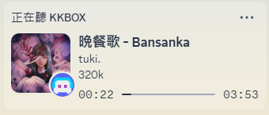

<h1> KKBOX Discord RPC</h1>

這是一個可以讓 Discord 顯示 KKBOX 豐富狀態的小工具！

 

[English](README_en.md) | **繁體中文** | [日本語](README_jp.md)

---

## ✨ 使用方法

- 點此下載最新版本的 [KKBOX Discord RPC](https://github.com/poyu39/kkbox-discord-rpc/releases/download/v4.1.3/KKBOX_Discord_RPC_v4.1.3.exe)

- 要顯示 KKBOX 的狀態於 Discord，請先執行 `KKBOX_Discord_RPC_v4.1.3.exe`，會自動開啟 KKBOX，此程式會在背景擷取播放內容，若不想使用此功能，可直接開啟官方 `KKBOX.exe`。

---

> 本軟體使用 [SignTool](https://github.com/Delphier/SignTool/releases/tag/v10.0.26100.14) 簽證憑證，確保軟體的完整性與安全性，但不一定確保 Windows Defender SmartScreen 不會誤判，若誤判請在保護歷程紀錄中允許此軟體執行。