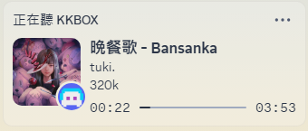

<h1> KKBOX Discord RPC</h1>

A small utility that displays KKBOX rich presence on Discord!

 

**English** | [繁體中文](README.md) | [日本語](README_jp.md)

---

## ✨ How to Use

- Click here to download the latest version of [KKBOX Discord RPC](https://github.com/poyu39/kkbox-discord-rpc/releases/download/v4.1.2/KKBOX_Discord_RPC_v4.1.1.exe)

- To display KKBOX status on Discord, first run `KKBOX_Discord_RPC_v4.1.2.exe`, which will automatically open KKBOX. This program will capture playback content in the background. If you don't want to use this feature, you can directly open the official `KKBOX.exe`.

---
